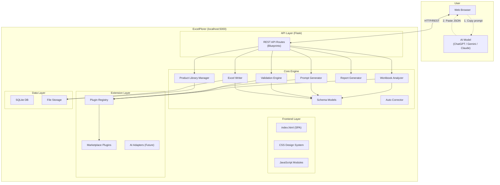
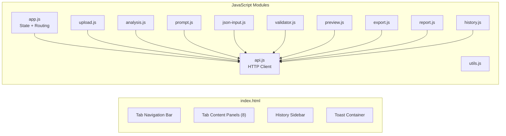
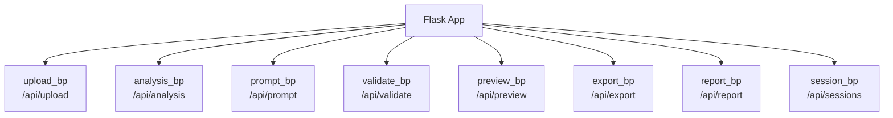
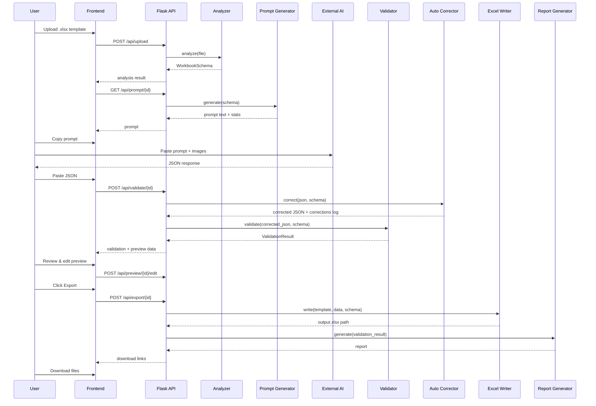
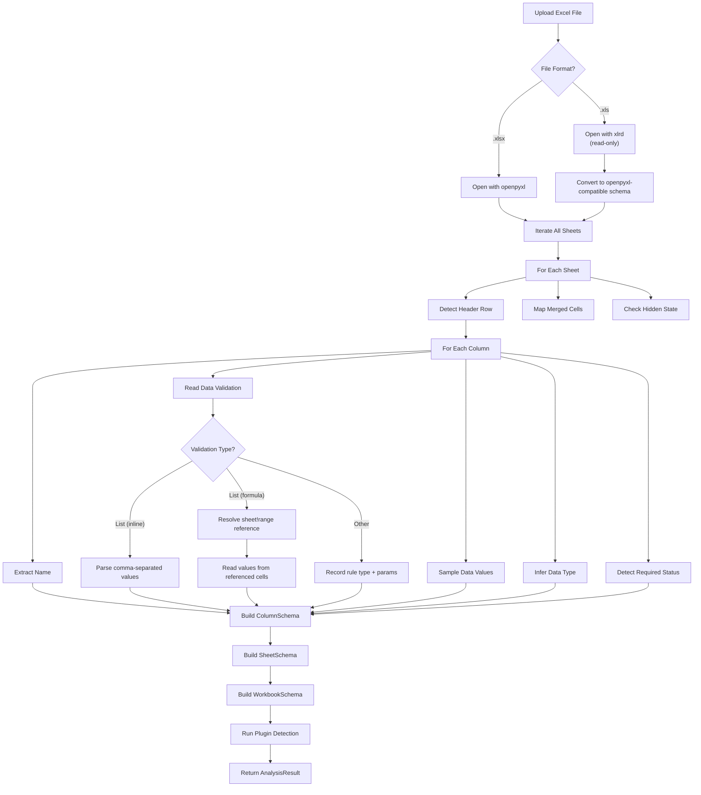
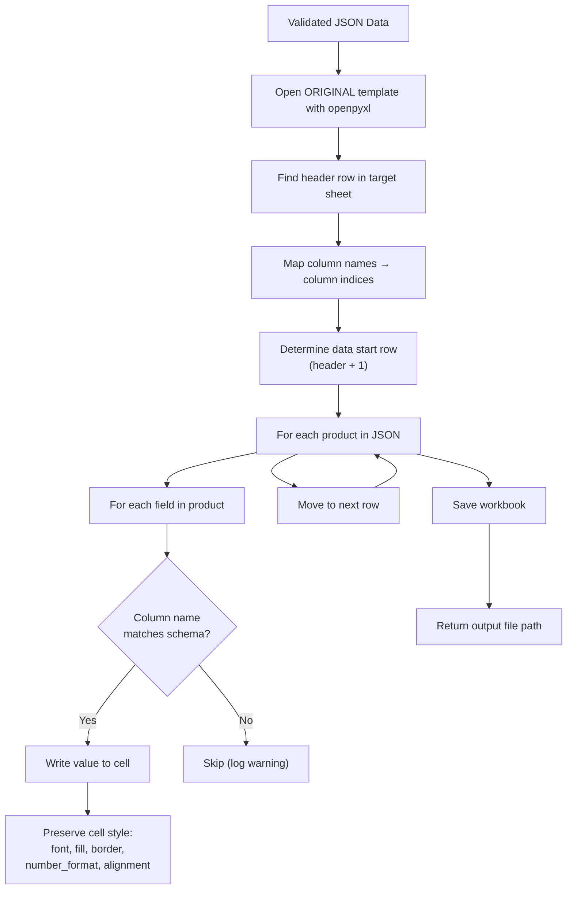
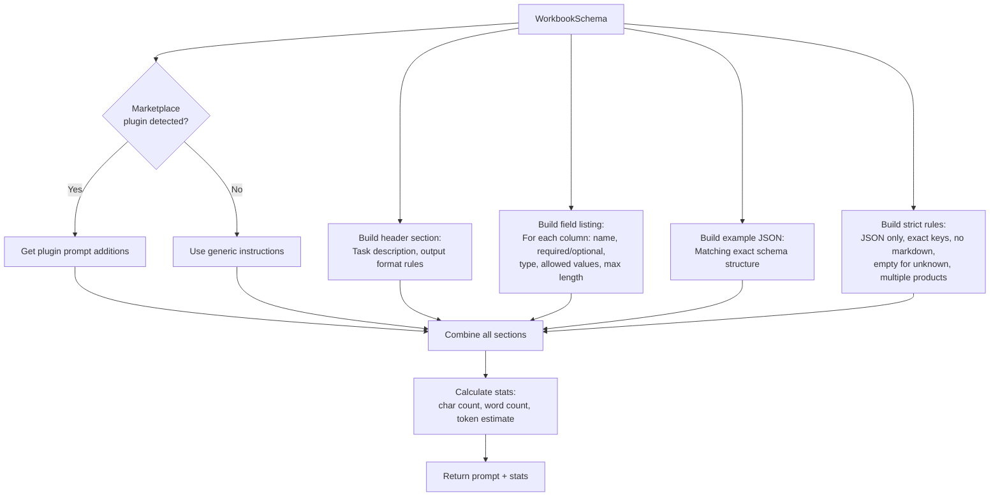
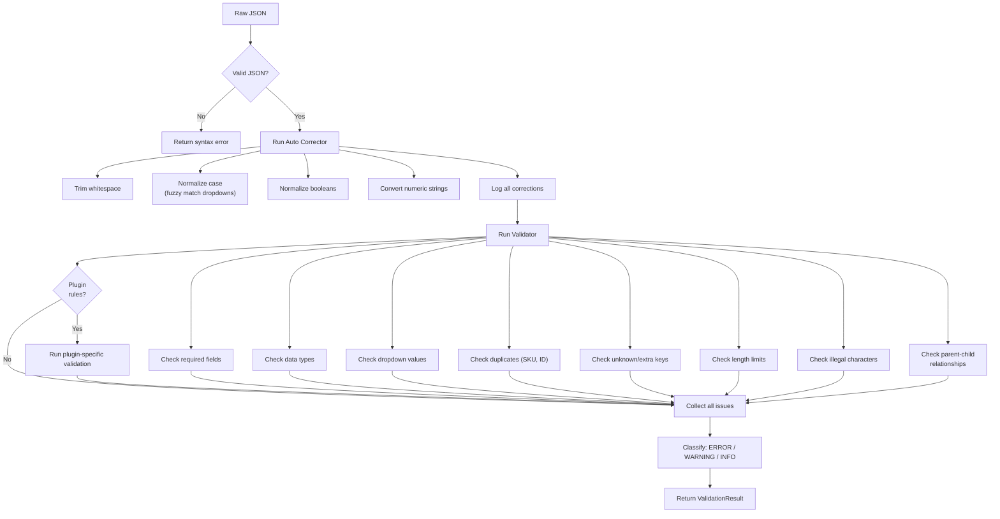
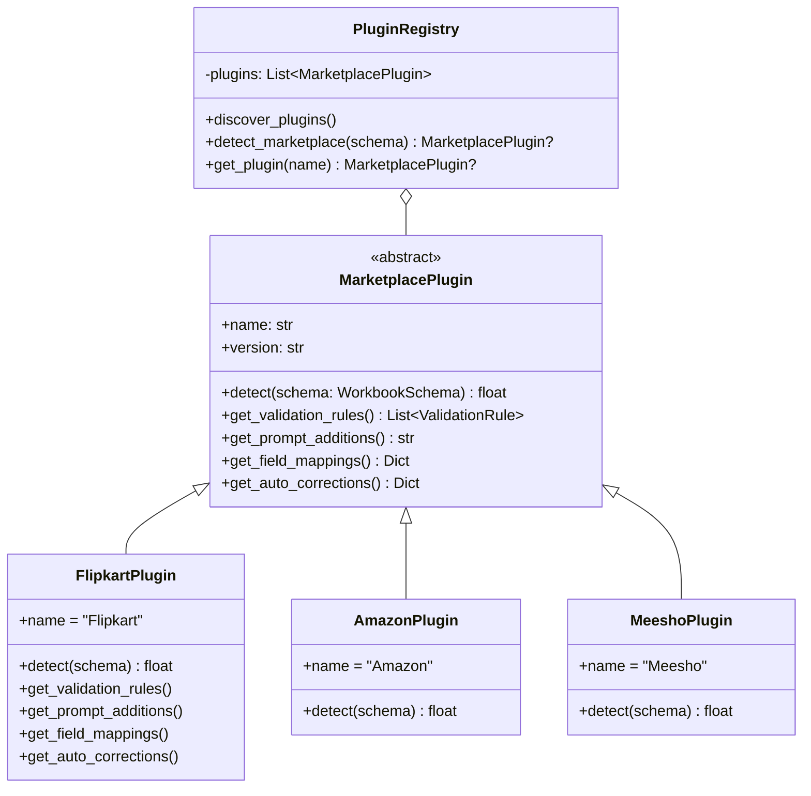
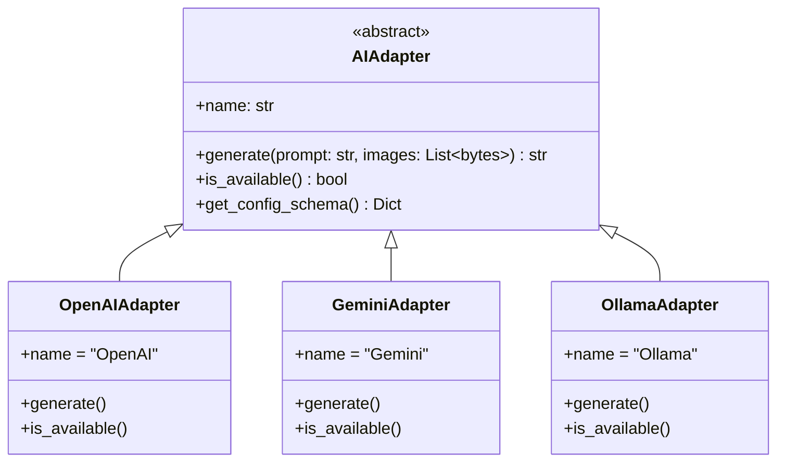

# Architecture Documentation

## ExcelPlorer — AI Spreadsheet Mapping Framework

**Version:** 1.0.0  
**Last Updated:** 2026-07-23

---

## 1. High-Level Architecture



---

## 2. Folder Structure & Module Responsibilities

```
excelplorer/
├── run.py                    # Entry point — starts Flask, opens browser
├── config.py                 # All configuration constants
│
├── backend/
│   ├── app.py                # Flask app factory, blueprint registration
│   │
│   ├── api/                  # HTTP request/response handling ONLY
│   │   ├── upload.py         # POST /api/upload
│   │   ├── analysis.py       # GET /api/analysis/<id>
│   │   ├── prompt.py         # GET /api/prompt/<id>
│   │   ├── validate.py       # POST /api/validate/<id>
│   │   ├── preview.py        # GET/POST /api/preview/<id>
│   │   ├── export.py         # POST/GET /api/export/<id>
│   │   ├── report.py         # GET /api/report/<id>
│   │   └── products.py       # CRUD /api/products
│   │
│   ├── core/                 # ALL business logic lives here
│   │   ├── schema.py         # Dataclass models (WorkbookSchema, SheetSchema, etc.)
│   │   ├── analyzer.py       # Reads Excel, produces WorkbookSchema
│   │   ├── prompt_generator.py  # WorkbookSchema → prompt text
│   │   ├── validator.py      # JSON + WorkbookSchema → ValidationResult
│   │   ├── auto_corrector.py # JSON + WorkbookSchema → corrected JSON
│   │   ├── excel_writer.py   # JSON + template → filled Excel
│   │   ├── report_generator.py  # ValidationResult → report (TXT/HTML/JSON)
│   │   └── session_manager.py   # Legacy SQLite session manager (kept for older endpoints)
│   │
│   ├── plugins/              # Marketplace-specific extensions
│   │   ├── base.py           # Abstract MarketplacePlugin class
│   │   ├── registry.py       # Plugin discovery and selection
│   │   ├── flipkart.py       # Flipkart detection, rules, mappings
│   │   ├── amazon.py         # Stub
│   │   └── meesho.py         # Stub
│   │
│   ├── ai/                   # Future AI direct-call adapters
│   │   ├── base.py           # Abstract AIAdapter class
│   │   ├── openai_adapter.py
│   │   ├── gemini_adapter.py
│   │   └── ollama_adapter.py
│   │
│   └── utils/                # Stateless helpers
│       ├── excel_utils.py    # Excel cell/range helpers
│       ├── json_utils.py     # JSON parsing/formatting helpers
│       └── logging_config.py # Logging configuration
│
├── frontend/                 # Served as Flask static files
│   ├── index.html
│   ├── css/
│   │   ├── main.css          # Design tokens, layout, theme
│   │   ├── components.css    # Buttons, cards, tables, inputs
│   │   └── animations.css    # Keyframes, transitions
│   └── js/
│       ├── app.js            # State management, tab routing
│       ├── api.js            # fetch() wrapper for all endpoints
│       ├── upload.js         # Drag-drop, file validation, upload
│       ├── analysis.js       # Render analysis results
│       ├── prompt.js         # Prompt display, copy, stats
│       ├── json-input.js     # JSON paste, validate, format
│       ├── validator.js      # Render validation issues
│       ├── preview.js        # Editable data table
│       ├── export.js         # Download triggers
│       ├── report.js         # Report rendering
│       └── utils.js          # DOM helpers, formatters, toasts
│
├── data/
│   ├── products/             # Auto-saved JSON products (keyed by SKU)
│   ├── sessions/             # Uploaded templates + exports per session
│   │   └── <session_id>/     # Each session gets a directory
│   │       ├── template.xlsx # Uploaded file
│   │       ├── schema.json   # Cached analysis
│   │       ├── input.json    # User-pasted JSON
│   │       ├── output.xlsx   # Generated Excel
│   │       └── report.*      # Generated reports
│   └── excelplorer.db        # SQLite database
│
└── tests/
```

### Responsibility Boundaries

| Layer | Responsibility | Does NOT |
|-------|---------------|----------|
| **API** | Parse HTTP requests, call core, return HTTP responses | Contain business logic |
| **Core** | All business logic, data processing, validation | Know about HTTP or frontend |
| **Plugins** | Marketplace-specific rules, detection, mappings | Modify core behavior directly |
| **AI** | Interface definition for future AI API calls | Make actual API calls in v1.0 |
| **Utils** | Stateless helper functions | Hold state or business logic |
| **Frontend** | User interaction, display, API communication | Process data or validate deeply |

---

## 3. Frontend Architecture

### Single-Page Application (SPA)

The frontend is a vanilla HTML/CSS/JS SPA. No frameworks. No build step.



### State Management

`app.js` maintains a simple global state object:

```javascript
const AppState = {
    currentTab: 'upload',
    sessionId: null,
    fileInfo: null,
    analysis: null,
    prompt: null,
    jsonData: null,
    validationResult: null,
    previewData: null,
    report: null,
    sessions: []
};
```

Tab modules read/write to `AppState` and call `api.js` for server communication.

---

## 4. Backend Architecture

### Flask App Factory Pattern

```python
# backend/app.py
def create_app(config=None):
    app = Flask(__name__, static_folder='../frontend', static_url_path='')
    # Register blueprints
    # Configure CORS
    # Set up logging
    # Initialize session manager
    return app
```

### Blueprint Organization

Each API module is a Flask Blueprint:



---

## 5. Data Flow

### Complete Pipeline



---

## 6. Excel Processing Pipeline

### Workbook Analysis



### Excel Writing



---

## 7. Prompt Generation Pipeline



---

## 8. Validation Pipeline



---

## 9. Plugin System

### Class Hierarchy



### Plugin Detection Flow

When a workbook is analyzed, the `PluginRegistry` runs detection on all registered plugins:

1. Each plugin's `detect()` receives the `WorkbookSchema`
2. Each plugin returns a confidence score (0.0–1.0)
3. The plugin with the highest score above a threshold (0.5) wins
4. If no plugin matches, the system uses generic behavior

---

## 10. Session Management

### SQLite Schema

```sql
CREATE TABLE sessions (
    id TEXT PRIMARY KEY,
    created_at TIMESTAMP DEFAULT CURRENT_TIMESTAMP,
    updated_at TIMESTAMP DEFAULT CURRENT_TIMESTAMP,
    filename TEXT NOT NULL,
    file_size INTEGER,
    marketplace TEXT,
    sheet_count INTEGER,
    status TEXT DEFAULT 'uploaded',  -- uploaded, analyzed, validated, exported
    schema_json TEXT,
    prompt_text TEXT,
    input_json TEXT,
    validation_json TEXT,
    corrections_json TEXT,
    export_path TEXT
);
```

### Session Lifecycle

```
uploaded → analyzed → prompt_generated → json_received → validated → exported
```

Each state transition updates `status` and `updated_at`.

---

## 11. Future AI Integration Architecture



The AI adapter layer is **fully decoupled** from the rest of the application. When implemented:

1. API gets a new endpoint: `POST /api/ai/generate`
2. Frontend gets an "AI Generate" button alongside the manual copy-paste flow
3. The adapter calls the AI API, gets JSON, and feeds it into the same validation pipeline
4. **Zero changes** to analyzer, validator, writer, or reporter

---

## 12. Error Handling Strategy

| Layer | Strategy |
|-------|----------|
| **API Routes** | Try/except with JSON error responses, HTTP status codes |
| **Core Modules** | Raise typed exceptions (`AnalysisError`, `ValidationError`, `WriterError`) |
| **Frontend** | API client catches errors, shows toast notifications |
| **File I/O** | Always use context managers, validate file existence before operations |
| **Excel Operations** | Catch openpyxl-specific exceptions, never corrupt the template |

### Custom Exceptions

```python
class ExcelPlorerError(Exception): ...
class AnalysisError(ExcelPlorerError): ...
class ValidationError(ExcelPlorerError): ...
class WriterError(ExcelPlorerError): ...
class PluginError(ExcelPlorerError): ...
class SessionError(ExcelPlorerError): ...
```

---

## 13. Logging Strategy

- Use Python's `logging` module
- Log file: `data/excelplorer.log`
- Console output in development, file-only in production
- Log levels:
  - `DEBUG` — Detailed analysis steps, cell-level operations
  - `INFO` — Session lifecycle, file uploads, exports
  - `WARNING` — Auto-corrections, skipped fields, plugin detection misses
  - `ERROR` — Validation failures, file I/O errors
  - `CRITICAL` — Application startup failures
- Structured format: `[%(asctime)s] %(levelname)s %(name)s: %(message)s`
- Each module gets its own logger: `logging.getLogger(__name__)`

---

## 14. API Reference

| Method | Endpoint | Request | Response |
|--------|----------|---------|----------|
| POST | `/api/upload` | multipart/form-data (file) | `{session_id, file_info}` |
| GET | `/api/analysis/<id>` | — | `{sheets, columns, validations, ...}` |
| GET | `/api/prompt/<id>` | — | `{prompt, char_count, word_count, token_count}` |
| POST | `/api/validate/<id>` | `{json_data}` | `{valid, issues[], corrections[], preview}` |
| GET | `/api/preview/<id>` | — | `{headers, rows, cell_statuses}` |
| POST | `/api/preview/<id>/edit` | `{row, column, value}` | `{success}` |
| POST | `/api/export/<id>` | — | `{excel_path, report_path}` |
| GET | `/api/export/<id>/download/<type>` | — | File download |
| GET | `/api/report/<id>` | `?format=html\|txt\|json` | Report content |
| GET | `/api/sessions` | — | `[{id, filename, date, status}, ...]` |
| GET | `/api/sessions/<id>` | — | Full session details |
| DELETE | `/api/sessions/<id>` | — | `{success}` |
